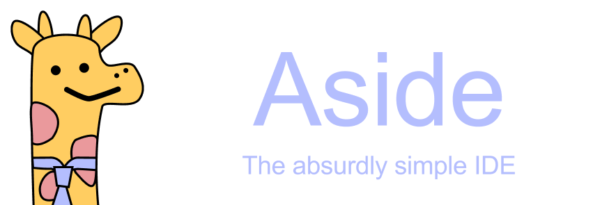

## About
Aside is a terminal-based IDE designed to do as little as possible so that you can do as much as possible. It will not automate your build process, integrate with git, or feed your code to our AI overlords. **Aside will never do anything more than allow you to edit your code efficiently, and all features that are added are to aide in that mission.**

## Infrequently Asked Questions
### Why is there a giraffe?
That is Aster, the official mascot of Aside. The idea of a giraffe wearing a necktie comes from a joke made in Randall Munroe's book, *What If?*. It's a reference to the glass-half-empty phrasal template, in which an optimist famously sees the glass as half full, and a pessimist sees it as half empty. According to Munroe, the absurdist sees a giraffe wearing a necktie. This joke can in fact be traced back to a viral meme from 2016, which asks reades whether a giraffe would hypothetically wear a necktie at the top of their neck or the bottom. We don't really care how Aster wears his necktie; he looks cute either way.

### Can you make Aside integrate with \<insert tool here\>?
No. Did you *read* the top part?

### Why should I use Aside?
Because it's easy. If you have ever used any text editor in your life, there is nothing new to learn. Though frankly, I couldn't care less whether you use it or not. I made this IDE for me.

### I use \<insert extension here\> for Nvim/VSCode/Jetbrains, can I still do that with Aside?
Probably not. Aside does not support extensions. If you want more functionality, make a feature request and I'll consider it.

### Why can't I click on anything?
Most terminals do not have mouse support, so neither does Aside.

